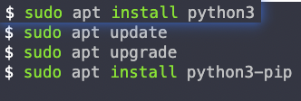
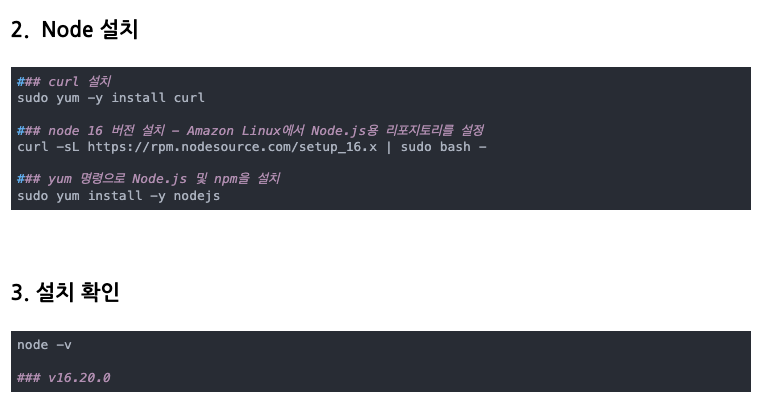

# jungle-wiki
크래프톤 정글 0주차 미니 프로젝트


# AWS 배포 시
1. pip 설치  

2. node 설치  


3. 파이썬 dependency 설치
```
    pip install -r requirements.txt
```
4. 노드 dependency 설치
```
    npm install
```
5. tailwind css 생성
```
    npx tailwindcss -i ./static/src/input.css -o ./static/dist/css/output.css
```